<!--
  This is your PROFILE README. It goes in a repo named exactly after your
  username (e.g. github.com/OCTOCAT/OCTOCAT) so GitHub shows it on your profile.
  Replace the ALL-CAPS placeholders. Widths 370/462 keep the portrait and info
  card the same height -- since we changed the info card's H to 400, we re-matched the widths.
-->

<table>
<tr>
<td valign="top"></td>
<td valign="top"></td>
</tr>
</table>

## Raghavendra

**Software Engineering Student · RAG & AI Engineering · Backend Architecture**

 

<!-- animated contribution graph, refreshed daily by the workflow -->

