<!--
  This is your PROFILE README. It goes in a repo named exactly after your
  username (e.g. github.com/OCTOCAT/OCTOCAT) so GitHub shows it on your profile.
  Widths 370/440 keep the portrait and info card the same height -- since we changed the info card's H to 420, we re-matched the widths.
-->

<table>
<tr>
<td valign="top"></td>
<td valign="top"></td>
</tr>
</table>

 

<!-- Diablo AI Agent Browser Card (Click to open Chat Space) -->

 
 

## Raghavendra

**Software Engineering Student · RAG & AI Engineering · Backend Architecture**

 

