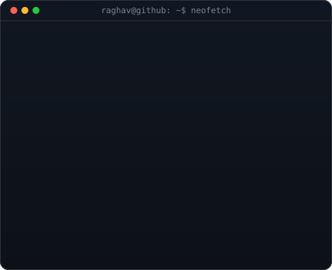

<table>
<tr>
<td valign="top"></td>
<td valign="top"></td>
</tr>
</table>

## Raghavendra Linga

**Software Engineering Student · Full-stack Products · AI/RAG · Backend Systems**

I build practical products end to end—from reliable APIs and data models to polished interfaces and AI-powered workflows.

